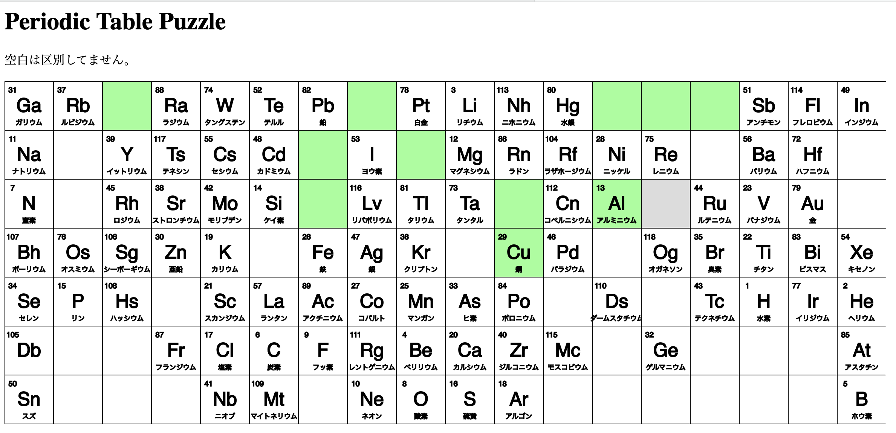

# PeriodicTablePuzzle

## 概要
急に思い立ちました、バカゲーを作りたいと。
その結果、周期表でスライドパズルをやろうと思いつきました。

多分、完成しても全然嬉しくないでしょうね。

## プレビュー

## デモプレイ
GitHub Pagesを利用したデモプレイへのリンクです。

https://tdtiger.github.io/PeriodicTablePuzzle/

## 遊び方
本リポジトリのファイルの階層関係を維持したまま、`index.html`を開くと遊べます。
ただし、外部ライブラリとして`p5.js`を利用しているため、インターネット環境が必要になります。

[p5.js](https://p5js-i18n-ja.pages.dev/ja/)

プレビューのような画面が表示されると、ゲームスタートです。
動かしたいパネルをクリックすると移動するので、根気よく正しい位置に移動させていってください。

薄灰色の部分が空きマスです(プレビューだと3行14列目のところ)。
どの元素が外されているかはランダムですし、空白の部分が外されている場合もあります。

正しい位置に移動したパネルは薄い緑色になります。

## 展望

- クリアタイム計測
- セーブ機能
- 元素ごとの色分け(アルカリ土類金属とか)

あたりができたらなと思ってます。